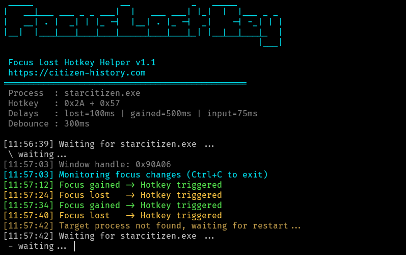

# Focus Lost Hotkey Helper

A lightweight Windows utility that automatically sends a configurable hotkey
when a specific application gains or loses focus.

Originally built for **Star Citizen** to toggle head tracking (e.g. Shift + F11),
but fully configurable and reusable for other applications.

Website: [https://citizen-history.com](https://citizen-history.com/other/star-citizen-tobii-toggle-alt-tab-focus-lost)

---

## Function

- Detects when a target process **gains or loses focus**
- Sends a configurable **scan-code based hotkey**
- Works with fullscreen / borderless games
- Survives process restarts (game crash / relaunch)
- Debounce protection against focus spam (overlays, alt-tab storms)
- Single-file EXE (self-contained, no .NET runtime required)
- Simple external INI configuration (no recompilation needed)

---

### Screenshot



---

## How it works (short version)

1. Waits for the target process to start
2. Tracks its window focus
3. On focus change:
   - brings the window to foreground
   - sends the configured hotkey using `SendInput`
   - restores the previous window
4. If the process exits, it automatically waits for it to restart

---

## Configuration

The application **requires** a configuration file named `focuslosthotkey.ini` 
in the same directory.

You can easy change things in the ini file which is default like:

```ini
[Process]
ProcessName = starcitizen
ProcessRescanDelayMs = 2000

[Hotkey]
ScanCodeModifier = 0x2A   # Shift (0 = none)
ScanCodeKey      = 0x57   # F11

[Timing]
DelayAfterFocusLostMs   = 100
DelayAfterFocusGainedMs = 500
DelayAfterInputMs       = 75
FocusDebounceMs         = 300
```

//TODO: Add some example for other keybindings

